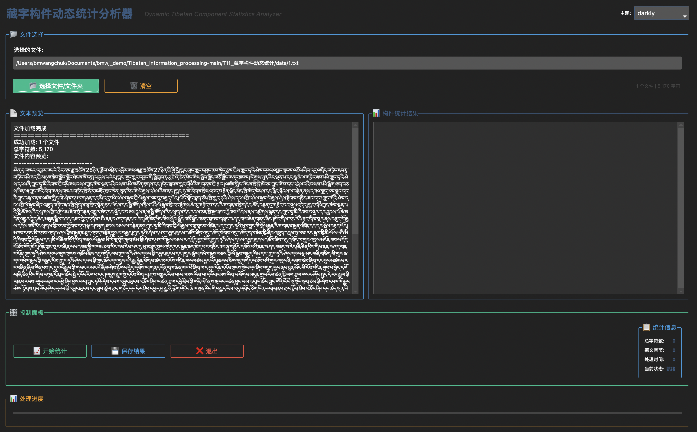
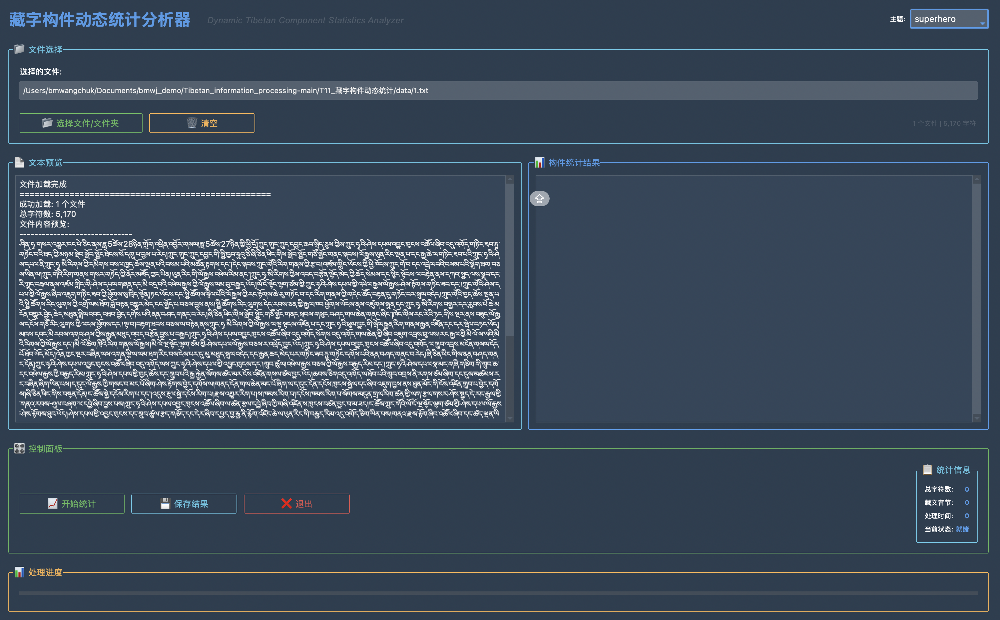
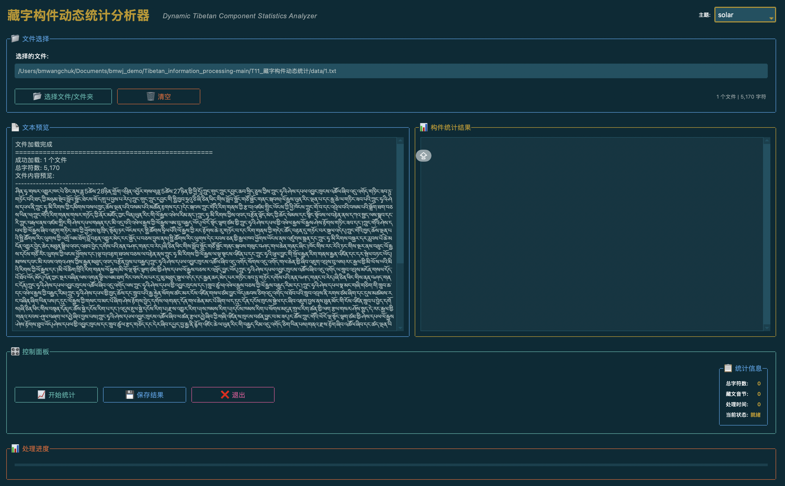
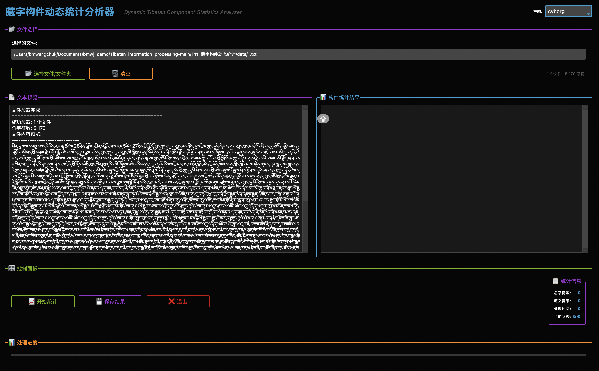
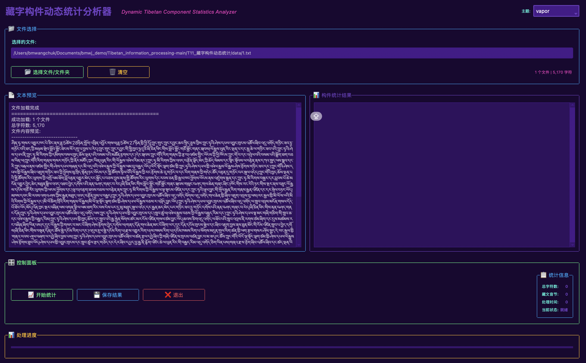
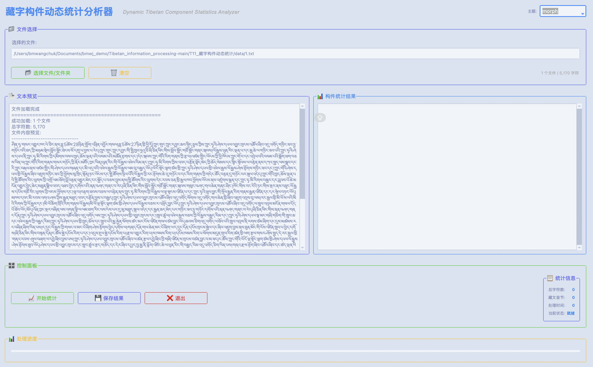
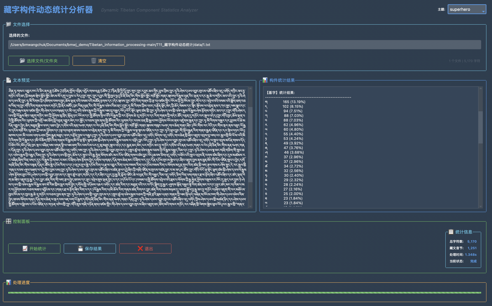

# 藏字构件动态统计分析器

<div align="center">
  
  <h3>Dynamic Tibetan Component Statistics Analyzer</h3>
  <p>一款现代化的藏文构件分析工具</p>
</div>

## 📝 项目简介
藏字构件动态统计分析器是一个专业的藏文文本分析工具，用于深入分析藏文文本中各类构件的使用情况。该工具采用模块化设计，具有直观的用户界面和高效的分析算法，能够快速处理大量藏文文本并生成详细的统计报告。


## ✨ 功能特点

- **多文件处理**：支持单个或多个藏文文本文件的分析
- **批量处理**：支持文件夹批量处理功能
- **实时进度**：动态显示处理进度，清晰直观
- **详细统计**：提供各类藏文构件的详细统计数据
- **美观界面**：多样性的UI设计，多种主题可选
- **结果导出**：支持将分析结果保存为文本文件
- **高效分析**：优化的算法确保快速处理大型文本

## 🖥️ 界面预览

程序采用现代化的界面设计，主要包括以下区域：

- **文件选择区**：选择要分析的藏文文件或文件夹
- **文本预览区**：显示加载的文本内容预览
- **统计结果区**：展示详细的构件统计结果
- **控制面板**：提供各种操作按钮和统计信息
- **进度显示**：实时显示处理进度
界面支持多种主题切换，包括：darkly、superhero、solar、cyborg、vapor、morph等。<br>
<div align="center">
  <div style="display: flex; flex-wrap: wrap; justify-content: center; gap: 10px;">
    <!-- 第一行 -->
    <div style="flex: 0 0 30%; margin-bottom: 10px;">
      
    </div>
    <div style="flex: 0 0 30%; margin-bottom: 10px;">
      
    </div>
    <div style="flex: 0 0 30%; margin-bottom: 10px;">
      
    </div>
    <!-- 第二行 -->
    <div style="flex: 0 0 30%; margin-bottom: 10px;">
      
    </div>
    <div style="flex: 0 0 30%; margin-bottom: 10px;">
      
    </div>
    <div style="flex: 0 0 30%; margin-bottom: 10px;">
      
    </div>
  </div>
</div>

## 🔧 项目结构

项目采用模块化设计，分为以下几个主要模块：

- `main.py` - 程序入口点，包含依赖检查功能
- `data_structures.py` - 数据结构和常量定义
- `component_analyzer.py` - 藏文构件分析核心逻辑
- `gui.py` - 图形用户界面实现
- `utils.py` - 工具函数和辅助方法
- `README.md` - 项目说明文档
- `run_dynamic_analyzer.sh` - 启动脚本

## 📋 使用方法

### 安装依赖

首先确保已安装必要的依赖：

```bash
pip install ttkbootstrap pillow
```

### 运行程序

方法1：使用Python直接运行

```bash
python ./main.py
```

方法2：使用启动脚本（Linux/Mac）

```bash
chmod +x T11_藏字构件动态统计/run_dynamic_analyzer.sh
./run_dynamic_analyzer.sh
```

### 使用流程

1. 在界面中选择要分析的藏文文件或文件夹
2. 查看文本预览，确认文件加载正确
3. 点击"开始统计"按钮进行分析
4. 查看右侧的详细统计结果
5. 可选择保存结果到文本文件
### 结果呈现
<div align="center">
  
</div>
## 🔍 技术实现

- **开发语言**：Python 3.6+
- **GUI框架**：tkinter + ttkbootstrap
- **分析算法**：基于18785个藏文构件的统计分析
- **界面设计**：现代化UI，支持多主题切换
- **模块化结构**：清晰的代码组织，便于维护和扩展

## 👨‍💻 作者

- **创建者**：Pemawangchuk
- **版本**：1.0
- **日期**：2025-04-06
